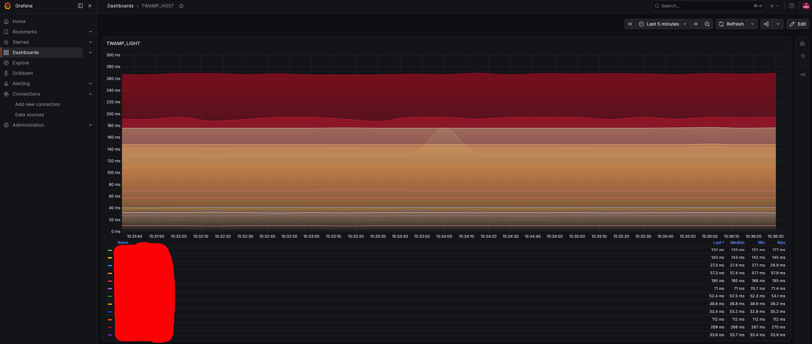
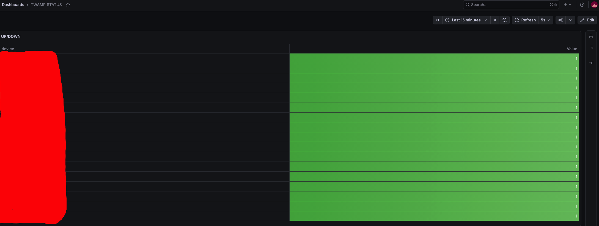
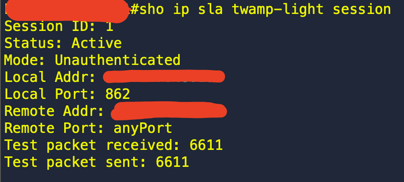

# Cisco TWAMP Light Monitoring Stack 🚀

[English](#english) | [Русский](#русский)

---

## English
> 💡 **Disclaimer / Use Case:**  
> This project was specifically developed and successfully used for monitoring network latencies (RTT) between Data Centers located across different continents over the public Internet. It provides high-precision data where standard ICMP ping is insufficient or heavily throttled by ISPs. PS - ICMP is not a diagnostic tool.

A production-ready automated solution for high-precision network latency (RTT) monitoring on Cisco hardware (IOS-XE / IOS-XR) using the **TWAMP Light (RFC 5357)** protocol.

The entire stack is containerized and managed via **Docker Compose**, allowing you to deploy the entire monitoring infrastructure as quickly as possible.

### 🛠 Architecture & Tech Stack
* **Python (Async TWAMP Exporter)** — A lightweight UDP-based script that sends TWAMP test packets to target routers every 2 seconds.
* **Prometheus** — Collects metrics, structures device identities using advanced `relabel_configs`, and monitors channel states.
* **Prometheus Alertmanager** — Handles alerts and sends granular Telegram notifications with specific router names upon failure.
* **Grafana** — Visualizes RTT latency graphs and provides a dedicated "Status Wall" dashboard for NOC/Helpdesk teams.

### 📊 Dashboard Preview
Dashboard as graphs:


Dashboard as table:


Verification:




### 🚀 Quick Start with Docker Compose

1. **Clone the repository:**
   ```bash
   git clone https://github.com/maklaren9000/Cisco-twamp-monitoring
   cd Cisco-twamp-monitoring-main
   ```

2. **Configure Telegram Alerts:**
   ```bash
   cp alertmanager/alertmanager.yml.example alertmanager/alertmanager.yml
   ```
   Open `alertmanager/alertmanager.yml` and paste your `bot_token` and `chat_id without quotes` 

3. **Add Your Routers:**
   Open `prometheus/prometheus.yml`, locate the `static_configs` block, and define your router IPs and names.

4. **Deploy the Stack:**
   ```bash
   docker compose up -d --build
   ```

#### 💡 How to set up dashboards in Grafana (Important):
1. **Units**: In the right-hand settings panel (Standard options -> Units), select `Time` -> `Milliseconds (ms)` to display the graph scale in milliseconds.
2. **Status Wall**: To display the ONLINE/DOWN table, use the `up{job="cisco-twamp-routers"}` query in *Instant* mode.
3. In the table settings (Value mappings), set the replacement rules: replace the value `1` with the text `ONLINE` (green), and the value `0` with `DOWN` (red).

### 🔒 Reliability & Storage Limits
* **Disk Protection:** Prometheus TSDB is restricted to `30d` retention or a maximum size of `10GB` to avoid filling up host storage.
* **Data Persistence:** Grafana configuration and dashboards are stored in a persistent Docker volume (`./grafana-data`), securing your work against container restarts.

## ⚙️ Cisco Hardware Configuration

To enable the routers to respond to TWAMP Light probes from this exporter, apply the following minimal configurations:

<details>
<summary>Cisco IOS-XE (v17.5+) Config Example</summary>

```cisco
ip sla responder twamp-light test-session 1 local-ip <RTR local ipv4 address> local-port 862 remote-ip <TWAMP-SERVER ipv4 address> remote-port any
```

</details>

<details>
<summary>Cisco IOS-XR (v6.9.x) Config Example</summary>

```cisco
performance-measurement
 endpoint ipv4 <TWAMP-SERVER ipv4 address>
  source-address ipv4 <RTR local ipv4 address>
 !
 interface <RTR local source interface>
 !
```

</details>

---

## Русский
> 💡 **Дисклеймер / Практический кейс:**  
> Этот проект изначально разрабатывался и успешно применялся для мониторинга сетевых задержек (RTT) между Дата-Центрами, расположенными на разных континентах, через публичную сеть Интернет. Он позволяет получать высокоточную телеметрию в условиях, когда стандартный ICMP (ping) блокируется или режется в приоритетах магистральными провайдерами. PS - ICMP не диагностика :)

Готовое решение для высокоточного мониторинга сетевых задержек (RTT) на оборудовании Cisco (IOS-XE / IOS-XR) по протоколу **TWAMP Light (RFC 5357)**.

Стек полностью контейнеризирован и управляется через **Docker Compose**, что позволяет развернуть всю инфраструктуру мониторинга максимально быстро.

### 🛠 Архитектура и Стек
* **Python (TWAMP Exporter)** — легковесный скрипт, отправляет TWAMP UDP-пакеты контроля задержки на роутеры с интервалом в 2 секунды.
* **Prometheus** — собирает метрики, склеивает IP-адреса с понятными именами хостов (через `relabel_configs`) и следит за состоянием каналов.
* **Prometheus Alertmanager** — обрабатывает сбои и отправляет точечные уведомления в Telegram-канал при падении конкретного роутера.
* **Grafana** — визуализирует графики задержек (RTT ms) и выводит интерактивную панель статусов (Status Wall) `ONLINE / DOWN` для дежурной смены (NOC).

### 📊 Скриншоты системы
Дашборд как график:


Дашборд как таблица:


Верификация:


### 🚀 Быстрый запуск через Docker Compose

1. **Клонируйте репозиторий:**
   ```bash
   git clone https://github.com/maklaren9000/Cisco-twamp-monitoring
   cd Cisco-twamp-monitoring-main
   ```

2. **Настройте уведомления в Telegram:**
   ```bash
   cp alertmanager/alertmanager.yml.example alertmanager/alertmanager.yml
   ```
   Откройте `alertmanager/alertmanager.yml` и вставьте ваш `bot_token` и `chat_id - без ковычек` ТГ канала.

3. **Добавьте свои роутеры:**
   Откройте `prometheus/prometheus.yml`, найдите блок `static_configs` и пропишите IP-адреса и имена ваших устройств по аналогии с примером.

4. **Запустите весь стек одной командой:**
   ```bash
   docker compose up -d --build
   ```

### 📊 Результат работы
* **Grafana** доступна по адресу: `http://localhost:3000`
* **Prometheus** доступна по адресу: `http://localhost:9090`
* **Умные уведомления**: При падении конкретного линка в Telegram-канал мгновенно прилетает раздельный красивый алерт с именем пострадавшего устройства и временем в формате UTC.

#### 💡 Как настроить панели в Grafana (Важно):
1. **Единицы измерения**: В правой панели настроек (Standard options -> Unit) выберите `Time` -> `Milliseconds (ms)`, чтобы шкала графика отображалась в миллисекундах.
2. **Таблица статусов (Status Wall)**: Для вывода таблицы ONLINE/DOWN используйте запрос `up{job="cisco-twamp-routers"}` в режиме *Instant*. 
3. В настройках таблицы (Value mappings) задайте правила замены: значение `1` менять на текст `ONLINE` (зеленый цвет), значение `0` — на `DOWN` (красный цвет).

### 🔒 Безопасность и Дисковые лимиты
* **Защита диска:** База данных Prometheus защищена от переполнения параметрами хранения истории (`retention.time=30d`, `retention.size=10GB`).
* **Сохранение данных:** Данные Grafana вынесены в постоянный том (`volume`), исключая потерю дашбордов при перезапуске или обновлении контейнеров.

## ⚙️ Конфигурация оборудования Cisco

Чтобы роутеры начали отвечать на TWAMP Light запросы от нашего экспортера, примените на них минимальные конфигурации:

<details>
<summary><b>Пример для Cisco IOS-XE (version 17.5+)</b></summary>

```cisco-XE
ip sla responder twamp-light test-session 1 local-ip <RTR local ipv4 address> local-port 862 remote-ip <TWAMP-SERVER ipv4 address> remote-port any
```
</details>

<details>
<summary><b>Пример для Cisco IOS-XR (version 6.9.x)</b></summary>

```cisco-XR
performance-measurement
 endpoint ipv4 <TWAMP-SERVER ipv4 address>
  source-address ipv4 <RTR local ipv4 address>
 !
 interface <RTR local source interface>
 !
```
</details>
